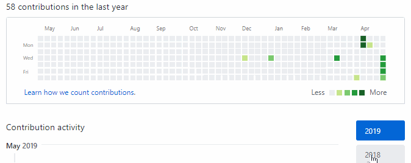

# commit hacker

- 功能

    生成随机commit记录
    
    30%的“摸鱼”成功率
    
    70%的"勤奋"中42%的随机"超级勤奋"
    
    ps： 摸鱼率和超级勤奋率可根据需求自行修改

- 使用方法

    创建一个空的repo，在repo目录下执行main.go即可

    ps：请使用ssh连接clone项目

    执行方式如下

    > go run main.go

- 使用效果

    
